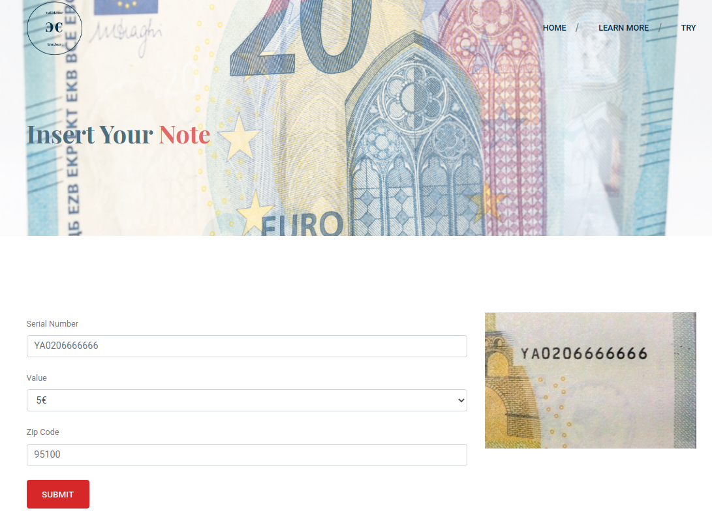

# Euro Validator&Tracker

Banknotes are one of the most important assets of a country. Some criminals introduce fake notes which bear a resemblance to original note to create discrepancies of the money in the financial market.  
Counterfeiting, which according to Italian law (and not only) constitutes a crime, is a phenomenon to which central banks pay the utmost attention since, if not kept under control, it can undermine public confidence in the currency, putting its integrity at risk.  
*Euro Validator&Tracker* is a web service to verify the genuineness of Euro notes analyzing only their serial. It is free and unofficial.  

## About Euro Notes

Euro (€) is the currency of the euro area and has been in circulation since 2002. The banknotes of the euro are issued by the national central banks of the Eurosystem or the European Central Bank.  
The euro notes contain many complex security features such as serial number, watermarks, invisible ink characteristics, holograms, optically variable inks and microprinting that document their authenticity.  

There are two series of euro banknotes:  
- 1st series issued from 2002;  
- 2st series or Europa series issued from 2013.

### Serial Number

Each note has a unique serial number of 12 characters:  
- 1st series notes have a letter as first character (that specifies the country of issue) and 11 digits;  
- 2st series notes have a letter as first character such as 1st series, but 10 digits because the second char is also letter in order to increment combinations.

Each country (i.e. first char) has a control code (for example the letter of Italy is 'S' and its control code is 7) and the sum of all digits and the ASCII of the second letter for Europa series until the result is less than 9 (i.e. the root), must be equals to control code in order to pass the checksum.  
*Example:*  
- *SA2160296285 is the serial number;*  
- *'S' specifies the country and, particularly, Italy with control code equals to 7;*  
- *the ASCII of A is 65;*  
- *the sum is: 6+5+2+1+6+0+2+9+6+2+8+5=52 -> 5+2=7*  
- *the obtained root coincides with the control code.*  

Tables of control codes and further information at [Wikipedia page](https://en.wikipedia.org/wiki/Euro_banknotes).  

## Structure and Technologies
    
For the development of this web service I have used the following technologies:  
- `Laravel`, a PHP web application framework;  
- `MySQL`, a relational database management system;  
- `jQuery`, a cross-platform JS library to simplify client-side scripting;  
- `Bootstrap`, a popular front-end framework.  

Moreover, I have used a website template offered by [Colorlib](https://colorlib.com/) and a color palette proposed by [Coolors](https://coolors.co/).  

The service requires the user to enter the serial number, the value of the note and the ZIP code of the place where that note has been received; all this information with the insert time and the result of validity check are stored in database; then the server will answer with the genuineness of the note and its history to know where and when that note has been recorded.  

Here, there are some screen of the webapp.

## Installation note

It needs machine with `Laravel` and `MySQL`; then you can clone this repository and from the directory of the project you can run `php artisan serve` that will boot a development server on which to test the service.

## Author

*Euro Validator&Tracker* has been developed by Maria Ausilia Napoli Spatafora, Computer Science student at University of Catania, Italy.
### Contacts
- email: [ausilianapoli@gmail.com](mailto:ausilianapoli@gmail.com)    
- LinkedIn: [Maria Ausilia Napoli Spatafora](https://www.linkedin.com/in/maria-ausilia-napoli-spatafora-b529b036/)

## License

*Euro Validator&Tracker* is open-sourced software licensed under the [A-GPL v3.0 license](https://www.gnu.org/licenses/agpl-3.0.html).
